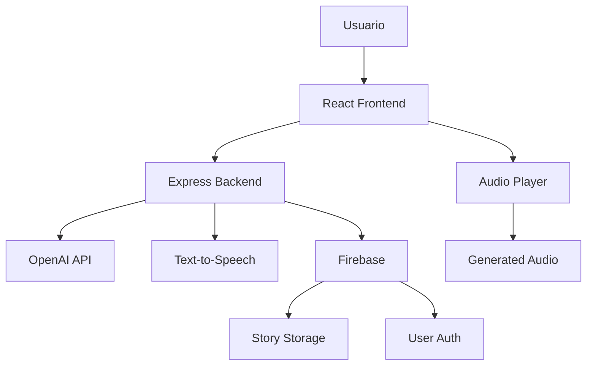

# 🎨 AudioGretel - AI Audio Story Generator

> **Generador de audiocuentos personalizados con IA para niños**  
> AI-powered personalized audio story generator for children

[](https://audiogretel.com)
[](https://reactjs.org/)
[](https://nodejs.org/)
[](LICENSE)

## 🌟 Características Principales

AudioGretel es una aplicación web innovadora que utiliza inteligencia artificial para crear cuentos de audio personalizados para niños. Perfecta para:

- 🎭 **Cuentos Personalizados**: Genera historias únicas basadas en protagonistas y temas elegidos
- 🌍 **Multiidioma**: Soporte para Español, Inglés y Francés
- 👶 **Grupos de Edad**: Contenido apropiado para 3-5, 6-8 y 9-12 años
- 🎵 **Audio Profesional**: Narración con voces naturales y música de fondo
- 📚 **Aprendizaje de Idiomas**: Ideal para familias multilingües
- ⚡ **Generación Instantánea**: Cuentos creados en tiempo real

## 🚀 Demo en Vivo

👉 **[Prueba AudioGretel aquí](https://audiogretel.com)**

### Páginas Principales:
- [Generador de Audiocuentos](https://audiogretel.com/herramientas/generador-audiocuentos)
- [Guía: Cómo Generar Audiocuentos con IA](https://audiogretel.com/como-generar-audiocuentos-ia)
- [Ejemplos de Cuentos](https://audiogretel.com/ejemplos)

## 🛠️ Stack Tecnológico

### Frontend
- **React 18** - Biblioteca de UI con hooks y context API
- **React Router** - Enrutamiento SPA
- **i18next** - Internacionalización (ES/EN/FR)
- **CSS3** - Diseño responsive moderno
- **Intersection Observer API** - Lazy loading optimizado

### Backend  
- **Node.js** - Runtime de JavaScript
- **Express.js** - Framework web
- **OpenAI API** - Generación de contenido con IA
- **Text-to-Speech APIs** - Síntesis de voz natural
- **Firebase** - Autenticación y almacenamiento

### DevOps & Performance
- **Netlify** - Hosting y CI/CD
- **Lighthouse CI** - Monitoreo de performance
- **Webpack Bundle Analyzer** - Optimización de bundles
- **Service Workers** - Caching estratégico

## 📱 Capturas de Pantalla

### Generador de Cuentos


### Reproductor de Audio


### Ejemplos de Cuentos


## 🎯 Casos de Uso

### 👨‍👩‍👧‍👦 Para Familias
- Cuentos personalizados para la hora de dormir
- Aprendizaje de idiomas en casa
- Entretenimiento educativo durante viajes

### 🏫 Para Educadores
- Material didáctico personalizado
- Práctica de comprensión auditiva
- Actividades de idiomas extranjeros

### 🩺 Para Terapeutas
- Herramienta de engagement para terapia del habla
- Estimulación cognitiva a través de narrativas
- Práctica de habilidades sociales

## 🔧 Instalación y Desarrollo

### Prerrequisitos
```bash
node >= 18.0.0
npm >= 8.0.0
```

### Configuración Local

1. **Clonar el repositorio**
```bash
git clone https://github.com/tu-usuario/audiogretel.git
cd audiogretel
```

2. **Instalar dependencias**
```bash
# Frontend
cd Cuentos_Front_Clean
npm install

# Backend
cd ../generador-cuentos-backend
npm install
```

3. **Variables de entorno**
```bash
# Frontend (.env)
REACT_APP_API_URL=http://localhost:5000
REACT_APP_FIREBASE_API_KEY=your_firebase_key

# Backend (.env)
OPENAI_API_KEY=your_openai_key
FIREBASE_ADMIN_SDK=your_firebase_admin_key
```

4. **Ejecutar en desarrollo**
```bash
# Backend (puerto 5000)
cd generador-cuentos-backend
npm run dev

# Frontend (puerto 3000)
cd ../Cuentos_Front_Clean
npm start
```

### Scripts Disponibles

```bash
# Performance y SEO
npm run performance      # Análisis de performance con PageSpeed
npm run lighthouse      # Audit completo con Lighthouse
npm run seo-check       # Verificación SEO completa
npm run sitemap         # Envío de sitemap a buscadores

# Desarrollo
npm run build           # Build de producción
npm run test           # Tests unitarios
npm run bundle-analyzer # Análisis de bundle size
```

## 🎨 Arquitectura del Sistema



## 📊 Performance

- **Lighthouse Score**: 95+ (Performance, SEO, Accessibility)
- **First Contentful Paint**: < 1.8s
- **Largest Contentful Paint**: < 2.5s
- **Cumulative Layout Shift**: < 0.1
- **Time to Interactive**: < 3.0s

## 🌍 SEO y Discoverabilidad

AudioGretel está optimizado para aparecer en:
- **Google Search**: "generador audiocuentos IA", "cuentos personalizados niños"
- **Gemini AI**: "herramientas IA educación", "generador cuentos audio"
- **ChatGPT**: Recomendaciones para familias y educadores

### Palabras Clave Objetivo
- Generador audiocuentos IA
- Cuentos personalizados niños
- Audio stories AI generator
- Multilingual children stories
- Educational AI tools
- Language learning kids

## 🤝 Contribuciones

¡Las contribuciones son bienvenidas! Por favor:

1. Fork el proyecto
2. Crea una rama para tu feature (`git checkout -b feature/AmazingFeature`)
3. Commit tus cambios (`git commit -m 'Add some AmazingFeature'`)
4. Push a la rama (`git push origin feature/AmazingFeature`)
5. Abre un Pull Request

### Áreas de Contribución
- 🌍 Nuevos idiomas (Italiano, Alemán, Portugués)
- 🎨 Temas y géneros de cuentos adicionales
- 🔊 Nuevas voces y estilos de narración
- ⚡ Optimizaciones de performance
- 🧪 Tests automatizados

## 📄 Licencia

Este proyecto está bajo la Licencia MIT - ver el archivo [LICENSE](LICENSE) para detalles.

## 🔗 Enlaces Útiles

- **Sitio Web**: [https://audiogretel.com](https://audiogretel.com)
- **Documentación**: [AudioGretel Docs](https://audiogretel.com/como-generar-audiocuentos-ia)
- **Generador**: [Crear Audiocuento](https://audiogretel.com/herramientas/generador-audiocuentos)
- **Ejemplos**: [Galería de Cuentos](https://audiogretel.com/ejemplos)

## 🏆 Reconocimientos

- **OpenAI** por la tecnología de generación de contenido
- **React Team** por el framework de UI
- **Firebase** por los servicios backend
- **Netlify** por el hosting y CI/CD

---

**¿Te gusta AudioGretel?** ⭐ ¡Dale una estrella al repo y compártelo!

**¿Tienes ideas?** 💡 Abre un issue o contribuye al proyecto

**¿Necesitas ayuda?** 📧 Contacta en [support@audiogretel.com](mailto:support@audiogretel.com)
